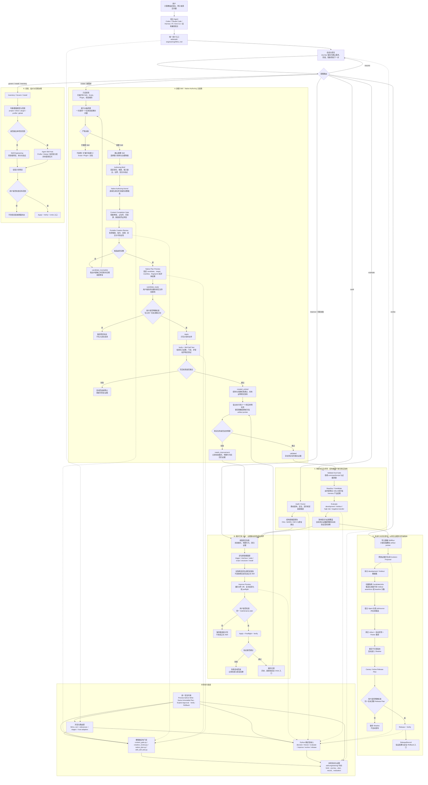

# Skill Engineering 执行架构与全生命周期流程图

适用范围：`v1.1.x Native Authoring` 当前实现。

这张图回答三个问题：

1. 用户从任何 Agent 宿主进入后，Skill Engineering 如何成为创建、维护、评测、演进和治理 Skill 的统一入口；
2. 一次新建 Skill 如何从模糊需求走到完整候选、受控写入和真实任务验证；
3. 创建完成后，失败证据如何进入维护或自进化闭环，而不是把 Skill 留在一个无人理解、无人验证的目录里。

## 读图结论

- **一个入口**：无论运行在 Codex、Claude Code、Hermes、Pi 还是 Kimi CLI，用户都从 `skill-engineering` 进入。宿主适配器只负责能力映射，不复制作者逻辑。
- **完整创建，不是骨架生成**：普通创建由 Native Authoring Kernel 生成任务专属完整候选；`skill-engineering create` 旧 CLI 只保留为 `1.0`/CI 的 `scaffold_only` 兼容路径，不进入普通用户主链路。
- **无外部 Creator 依赖**：核心创建不依赖官方 `skill-creator`、Superpowers、宿主专用作者 Skill 或独立 Python CLI。Python 核心仍提供高级、CI、评测、维护和发布能力。
- **所有写入都有同一个安全边界**：先预览，再由用户批准同一份不可变计划；发现 candidate、target 或 plan 漂移时拒绝写入；写后验证失败时回滚或安全停止。
- **创建完成不等于真实有效**：结构检查通过后只能到 `created_untried`；至少一个真实任务有通过证据后，才进入 `validated`。
- **失败进入闭环**：真实任务失败进入 `needs_improvement`，随后以失败模式、预期行为和回归证据驱动维护；积累足够证据后也可进入自进化。
- **发布范围受控**：Shadow 可自动形成；Canary/Active 必须明确批准；Global、Profile 和多项目分发由 Agent Skill Hub 管理，不会被 Skill Engineering 自动开启。

## 当前版本边界

- 本图覆盖 `v1.1.x` 的完整创建与既有 `1.0.x` 生命周期能力。
- 创建后的注释式阅读、Guided Tour 和 Skill Graph 属于规划中的 `1.2.0`，不在本图当前执行链路内。
- `2.0.x Architecture Guardian` 当前暂停；Blueprint/IR 不应被描述为 `v1.1.x` 已启用的写入门禁。
- Hermes 无 Creator 真实 E2E 是 `v1.1.0` 的发布证据门禁，不是产品运行时对 Hermes Creator 的依赖。

## 主要事实源

| 关注点 | 文件 |
|---|---|
| 用户唯一入口与意图路由 | [`skills/skill-engineering/SKILL.md`](../../skills/skill-engineering/SKILL.md) |
| 当前三层架构 | [`docs/architecture.md`](../architecture.md) |
| Native Authoring 决策 | [`ADR 0008`](../adr/0008-native-authoring-kernel.md) |
| v1.1 范围与验收 | [`v1.1 Spec`](../specs/2026-07-29-v1.1-native-authoring-spec.md) |
| v1.1 实施顺序 | [`v1.1 Plan`](../plans/2026-07-29-v1.1-native-authoring-plan.md) |
| Skill 内部文件职责 | [`file-map.md`](../../skills/skill-engineering/references/file-map.md) |
| 当前版本完成状态 | [`TASK.md`](../TASK.md) |
