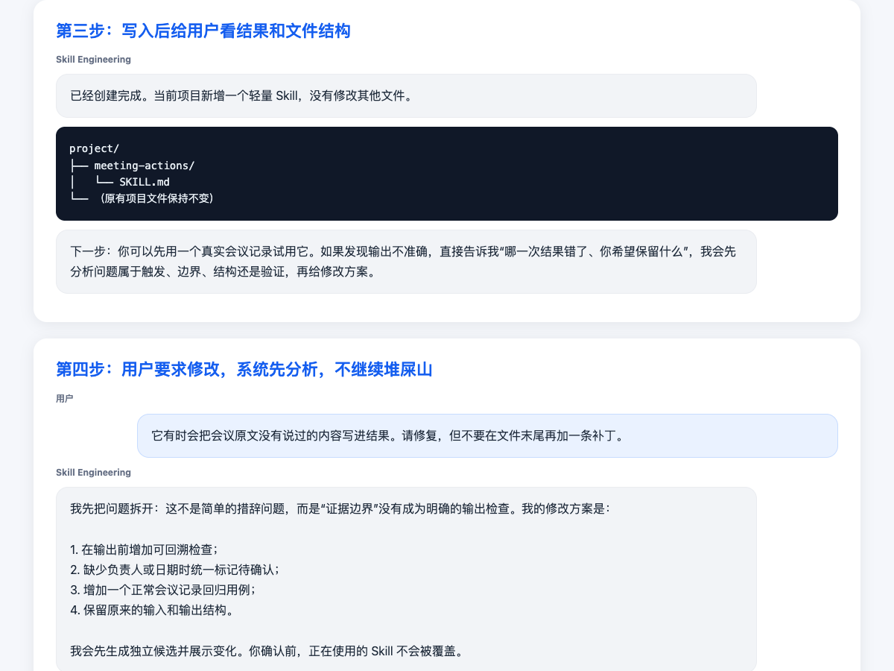

# 安装 Skill Engineering 之后，普通用户怎样创建并维护自己的第一个 Skill

日期：2026-07-16

这篇记录只站在普通用户视角：用户已经完成 Skill Engineering 安装，接下来直接在任意项目中说出目标。文中不展示 Doctor 分数、JSON、计划编号或内部维护状态，只记录用户说了什么、系统如何引导、什么时候确认、最终创建了哪些文件。

## 第一步：用户只需要说出目标

用户不需要先学习 Skill 架构，也不需要决定应该创建哪些文件。他只需要描述反复发生的工作：

> 我每周都要把会议记录整理成决策、负责人和截止时间。帮我做一个 Skill。

Skill Engineering 不会立刻建目录，而是先问一个真正会改变方案的问题：这个流程是个人偶尔使用，还是团队长期复用？

用户回答“先给个人使用，以后可能给团队用”后，系统选择轻量、可迁移的第一版，不提前塞入完整团队治理结构，并明确告诉用户：下一步只生成创建预览，不会修改文件。


这一阶段解决的是“到底该不该做、第一版应该多重”，而不是让用户填写一份技术表格。

## 第二步：先给方案和预览，用户决定是否写入

系统向用户展示可理解的方案：

- 名称：`meeting-actions`；
- 负责：从会议记录提取决策、负责人和截止时间；
- 不负责：总结情绪、猜测未明确的承诺、自动修改任务系统；
- 缺少信息时标记待确认，不允许猜测。

用户能够直接判断这个范围是否符合目标。此时项目中还没有新增文件。

只有当用户明确说“这个范围符合我的目标，可以写入”，系统才进入真实写入阶段，并再次说明：只会写入刚才确认的方案。


这个确认不是让用户批准内部编号，而是批准一个看得懂的实际动作：在当前项目中创建一个明确范围的 Skill。

## 第三步：写入以后，直接告诉用户创建了什么

写入完成后，用户看到的是结果和文件结构，而不是一长串内部检查日志：

```text
project/
├── meeting-actions/
│   └── SKILL.md
└── （原有项目文件保持不变）
```

第一版是简单的个人 Skill，所以只创建一个必要入口，没有为了“看起来工程化”提前生成空目录、复杂 contract 或无用模板。



系统接着给出一个清楚的下一步：拿一份真实会议记录试用。如果发现问题，告诉它“哪一次结果错了，以及希望保留什么”。

## 第四步：用户提出修改时，不是在文件末尾继续堆规则

用户试用后发现：

> 它有时会把会议原文没有说过的内容写进结果。请修复，但不要在文件末尾再加一条补丁。

系统不会直接追加“严禁胡说”之类的新口号，而是先判断根因：证据边界没有成为明确的输出检查。

因此修改方案分成四个动作：

1. 输出前增加可回溯检查；
2. 缺少负责人或日期时统一标记待确认；
3. 增加正常会议记录回归用例；
4. 保留原来的输入和输出结构。

系统先生成独立候选，正在使用的 Skill 不会被覆盖。用户确认候选保留旧能力并包含回归用例后，才应用修改；旧版本仍有备份，可以撤回。


这就是“结构化维护”和“堆屎山修改”的区别：

```text
堆屎山：发现一次失败 → 在文件末尾再加一条禁令

结构化维护：
失败案例
  → 判断属于触发、边界、结构还是验证
  → 生成独立候选
  → 保留旧能力的回归用例
  → 用户确认
  → 应用并保留撤回入口
```

## 用户真正感受到的完整过程

```text
安装 Skill Engineering
  ↓
说出自己想反复完成的工作
  ↓
系统只问会改变结果的关键问题
  ↓
展示职责边界和创建预览
  ↓ 用户确认
写入最小可用文件结构
  ↓
真实试用
  ↓
用失败案例驱动结构化修改
```

用户不需要理解内部 plan、fingerprint、Doctor 规则或维护记录。这些机制只负责在背后保证：没有确认就不写入，修改不会悄悄破坏旧能力，失败时可以阻止或撤回。
