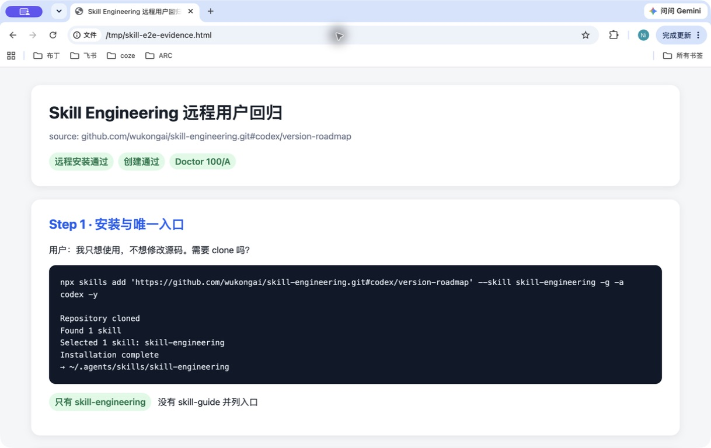
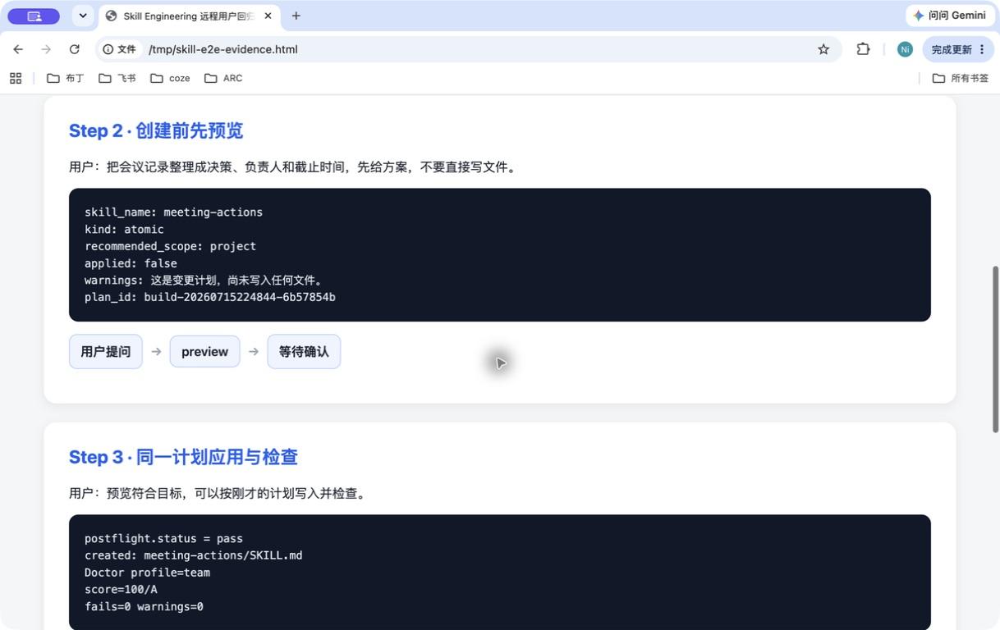
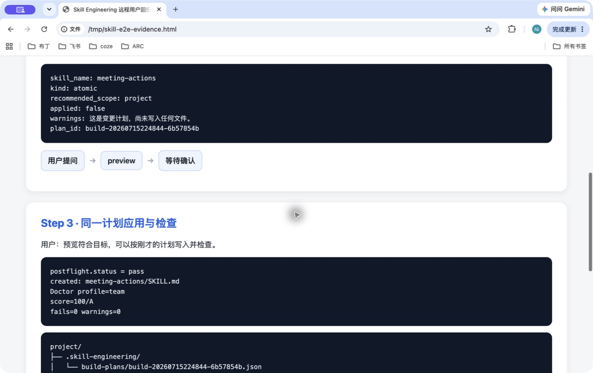
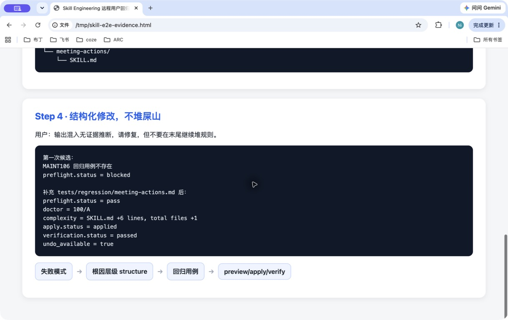

# Skill Engineering 远程工程回归证据：安装、创建、检查与维护门禁

> 本文是内部工程证据，包含安装器、Doctor 和维护门禁输出，不是普通用户体验主文。面向用户的完整创建过程请阅读 [`2026-07-16-user-creation-journey-article.md`](2026-07-16-user-creation-journey-article.md)。

日期：2026-07-16

测试源：`https://github.com/wukongai/skill-engineering.git#codex/version-roadmap`

范围：模拟一个只想使用 Skill Engineering 的普通用户，不克隆源码、不修改仓库；从标准安装器开始，在任意临时项目中创建一个 Skill，检查它，再模拟一次维护修改。

## 结论先说

刚推送的远程分支已通过完整用户流程：

- 标准 `npx skills add` 能找到唯一的 `skill-engineering`；
- 安装后的 Skill Doctor 为 100/A；
- 创建遵守 preview → 同一 plan apply；
- 新建 Skill 的 team Doctor 为 100/A；
- 维护修改先做结构分析，缺少回归用例时会阻断；补齐用例后才能 apply 和 verify；
- 全程没有把 `skill-guide` 安装成第二个入口。

> 说明：本次测试使用刚 push 的 `codex/version-roadmap` 分支。默认 `main` 仍需合并这次提交后，普通用户才可以省略 URL 后的 `#codex/version-roadmap`。

## 第一步：用户安装

### 用户提问

> 我只想使用 Skill Engineering，不想修改源码。是不是不需要 clone？

### 用户引导

不需要 clone。使用标准 Agent Skills 安装器：

```bash
npx skills add \
  'https://github.com/wukongai/skill-engineering.git#codex/version-roadmap' \
  --skill skill-engineering -g -a codex -y
```

`-g` 表示用户级全局范围，`-a codex` 指定 Codex；Claude Code 将其换成 `-a claude-code`。普通用户不需要 Python、uv 或源码目录。

### 实际结果

安装器输出了：

```text
Repository cloned
Found 1 skill
Selected 1 skill: skill-engineering
Installation complete
→ ~/.agents/skills/skill-engineering
```

隔离 HOME 中只有一个顶层 Skill：

```text
.agents/skills/
└── skill-engineering/
    ├── SKILL.md
    ├── agents/openai.yaml
    ├── skill.contract.yaml
    ├── references/
    ├── scripts/
    └── tests/
```



## 第二步：用户提出创建请求

### 用户提问

> 我想把会议记录整理成决策、负责人和截止时间。这个应该做成 Skill 吗？先给我方案，不要直接写文件。

### 用户引导

Skill Engineering 先生成 immutable plan，不直接写入目标目录。测试命令等价于用户在 Agent 中提出上述目标后，观察创建预览：

```text
skill_name: meeting-actions
kind: atomic
recommended_scope: project
applied: false
```

预览中列出待生成的 `SKILL.md`、省略的复杂文件、验证命令和 plan id。用户此时可以检查边界，而不是被迫接受一个已经写入的目录。



## 第三步：用户确认并检查结果

### 用户提问

> 预览内容符合我的目标，可以按刚才那份计划写入吗？写完后帮我检查。

### 用户引导

只有用户确认后，才使用同一个 plan id apply：

```bash
skill-engineering create --plan <同一个 PLAN_ID> --apply --json
```

实际结果：

- `postflight.status = pass`；
- 只创建 `meeting-actions/SKILL.md`；
- 新 Skill 的 team Doctor 为 100/A；
- 临时项目状态目录记录在 `.skill-engineering/build-plans/`。

文件夹结构如下：

```text
project/
├── .skill-engineering/
│   └── build-plans/
│       └── build-<PLAN_ID>.json
└── meeting-actions/
    └── SKILL.md
```



## 第四步：用户要求修改，是否会变成“堆屎山”？

### 用户提问

> 这个 Skill 偶尔会把会议原文没有支持的推断写进结果。请修复，但不要在文件末尾继续堆规则；先告诉我问题属于哪一层，并证明旧输出不会被破坏。

### 用户引导

维护流程先要求四件事：

1. 失败模式：输出混入无证据推断；
2. 根因层级：`structure`；
3. 预期行为：增加可回溯性和待确认边界，保留原输出结构；
4. 回归用例：正常会议记录仍输出决策、负责人和截止时间。

第一次候选故意没有回归文件，preview 被 `MAINT106` 阻断：

```text
回归用例不存在: 正常会议记录仍输出决策、负责人和截止时间
preflight.status = blocked
```

这一步证明系统不会因为“看起来只是加几行规则”就直接覆盖原 Skill。

补上 `tests/regression/meeting-actions.md` 后，第二次 preview 通过：

```text
preflight.status = pass
doctor: 100/A
complexity: SKILL.md +6 lines, total files +1
```

随后使用同一个 plan apply，维护记录显示 `status = applied`，verification 显示 `status = passed`，并保留 undo 入口。



## 用户最终得到什么

```text
安装
  ↓
唯一 Skill：skill-engineering
  ↓
提出目标，先判断和预览
  ↓ 用户确认
同一 plan apply
  ↓
Doctor 检查
  ↓
失败模式 + 根因层级 + 回归用例
  ↓
候选 preview → apply → verify / undo
```

这条链路的关键不是“多写几条提示词”，而是每次写入前都能回答：为什么改、改哪一层、会不会破坏旧行为、如何撤回。

## 复测入口

你之后可以用同一条远程分支命令复测：

```bash
npx skills add \
  'https://github.com/wukongai/skill-engineering.git#codex/version-roadmap' \
  --skill skill-engineering -g -a codex -y
```

如果这次提交已经合并到默认 `main`，则改成普通用户最终命令：

```bash
npx skills add wukongai/skill-engineering \
  --skill skill-engineering -g -a codex -y
```
