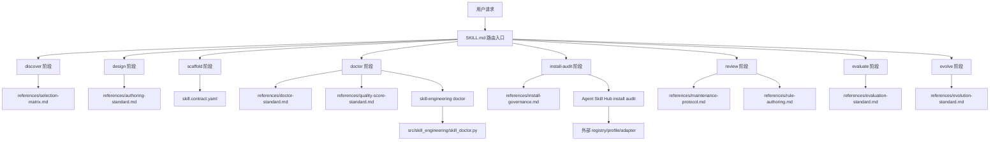

# Skill Engineering 文件地图

这份文件是给人审核用的总览。你可以从这里快速看懂整个 skill 的结构、每个文件的职责,以及 agent 在不同任务里会读哪些文件。

更完整的仓库级说明见 `docs/guides/skill-engineering-file-guide.md`。

说明:`stages/` 是本 skill 的内部 workflow step 拆分,不是 Anthropic Agent Skills 官方必需目录。简单 skill 不需要拆 workflow;只有复杂流程会让根 `SKILL.md` 变厚时,才把步骤拆成 `INSTRUCTIONS.md`。

## 文件说明

| 文件 | 职责 | 什么时候读 |
|---|---|---|
| `SKILL.md` | 根入口。只放触发、路由、输出、停止点和验证命令。 | skill 被选中后一定读。 |
| `skill.contract.yaml` | 机器可读契约。描述输入、输出、停止点、委托、禁止行为、状态和 provider 凭证边界。 | 设计、review 或 contract audit 时读。 |
| `agents/openai.yaml` | UI 元数据和默认 prompt。 | agent UI 展示 skill 时使用。 |
| `references/selection-matrix.md` | 判断该做 skill、plugin、script、doc、profile 还是 no-op。 | 任何创建动作之前读。 |
| `references/authoring-standard.md` | 高质量 skill 的撰写标准。 | 新建 skill 或大重构时读。 |
| `references/doctor-standard.md` | Doctor rule id、级别、profile、报告要求。 | 实现 doctor 或审核报告时读。 |
| `references/quality-score-standard.md` | 0-100 质量评分维度、等级和使用方式。 | 需要解释分数、低分建议或安装前评估时读。 |
| `references/install-governance.md` | global/project/profile/direct/plugin/archive 暴露模型。 | 审计安装范围和 profile 决策时读。 |
| `references/maintenance-protocol.md` | 修复流程和根因层级。 | 修复或 review 旧 skill 时读。 |
| `references/rule-authoring.md` | 如何新增规则而不制造规则堆。 | 添加或调整 lint/doctor 规则时读。 |
| `references/evaluation-standard.md` | 类型感知、证据 coverage、utility claim 和 case portfolio 标准。 | 评测或横向比较 skill 时读。 |
| `references/evolution-standard.md` | A3 证据、候选、评测、版本与发布边界。 | 用户要求 Skill 根据真实运行结果自进化时读。 |
| `stages/discover/INSTRUCTIONS.md` | 内部 workflow step:收集例子、反例和选择约束。 | 新能力还模糊时读。 |
| `stages/design/INSTRUCTIONS.md` | 内部 workflow step:把能力转成 contract 和资源计划。 | 设计复杂 skill 时读。 |
| `stages/scaffold/INSTRUCTIONS.md` | 内部 workflow step:创建最小文件集。 | 设计确认后读。 |
| `stages/doctor/INSTRUCTIONS.md` | 内部 workflow step:体检单个 skill。 | 检查已有 skill 健康度时读。 |
| `stages/install-audit/INSTRUCTIONS.md` | 内部 workflow step:审计安装暴露和路由成本。 | 检查 global/project/plugin/profile 时读。 |
| `stages/review/INSTRUCTIONS.md` | 内部 workflow step:审核一次 skill 变更。 | 接受修复或 PR 前读。 |
| `stages/evaluate/INSTRUCTIONS.md` | 内部 workflow step:区分静态 readiness 与真实 utility。 | 评测、打分或比较 skill 时读。 |
| `stages/evolve/INSTRUCTIONS.md` | 内部 workflow step:自动形成候选并推进到 Shadow/Release Plan。 | 自进化或周期性优化 Skill 时读。 |
| `scripts/doctor_skill.py` | 对 Python CLI Doctor 的薄包装；缺少 CLI 时停止并给出安装指引。 | 需要从 skill 内直接跑单 skill 体检时用。 |
| `scripts/render_report.py` | 把 JSON doctor 报告渲染成 Markdown。 | 需要分享审计报告时用。 |
